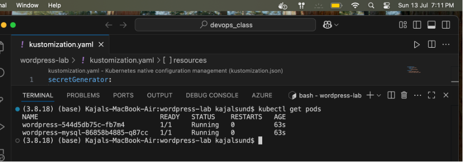
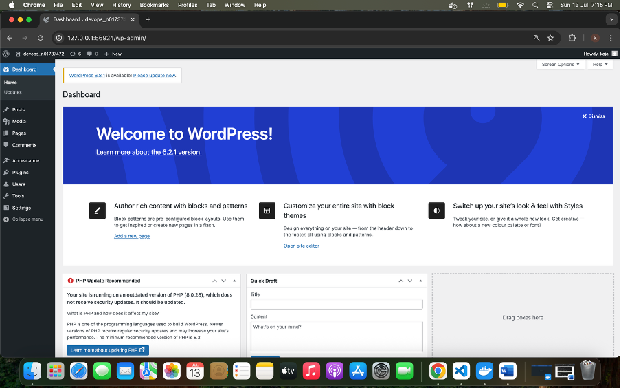
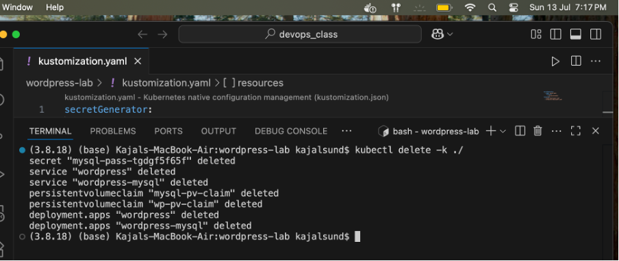

# WordPress & MySQL Kubernetes Lab with Persistent Volumes

This repository contains Kubernetes manifests and configuration files to deploy a WordPress website backed by a MySQL database on Minikube. The deployment uses PersistentVolumes and PersistentVolumeClaims to ensure data persistence.

---

## Features

- MySQL deployment with persistent storage
- WordPress deployment with persistent storage
- Secure password management using kustomize Secret Generator
- LoadBalancer service for WordPress frontend
- Headless service for MySQL database

---

## Prerequisites

- [Minikube](https://minikube.sigs.k8s.io/docs/start/) installed and running
- [kubectl](https://kubernetes.io/docs/tasks/tools/) installed and configured for Minikube
- Internet access to download container images

---

## Usage

### 1. Replace the password in `kustomization.yaml`

Edit the `kustomization.yaml` file and replace `YOUR_PASSWORD` with a secure password of your choice.

```yaml
secretGenerator:
- name: mysql-pass
  literals:
  - password=YOUR_PASSWORD
```
### 2. Apply the manifests

```bash
kubectl apply -k ./
```
### 3. Verify the deployment
Check Secrets:

```bash
kubectl get secrets
```
Check PersistentVolumeClaims:

```bash
kubectl get pvc
```
Check Pods status:

```bash
kubectl get pods
```

Check Services:

```bash
kubectl get services
```
### 4. Access WordPress site
Get the service URL using Minikube:

```bash
minikube service wordpress --url
```
Open the URL in your browser to see the WordPress site.

Cleanup
To delete all resources created by this lab:

```bash
kubectl delete -k ./
```
